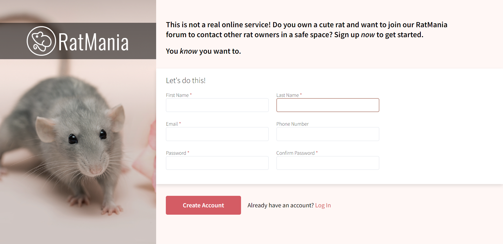
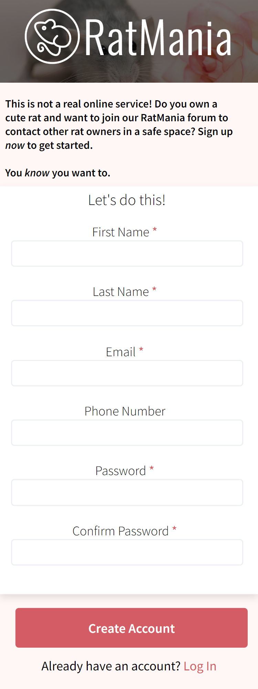

# Rat-Forum Sign Up Form
It's a "Project: Sign-Up Form" for Odin Project. I've decided to create a sign-up page for a rat owners forum.
## Sign-Up Form
### Desktop version

### Mobile version

## Links
- [Link to the Assignment](https://www.theodinproject.com/lessons/node-path-intermediate-html-and-css-sign-up-form)
- [Check this sign-up form out here!](https://quazf1x.github.io/Rat-Forum-SignUp-Page/)

## Future plans
- <del>Add JavaScript to check user passwords</del>
- <del>Add RegExp to the password input </del>
